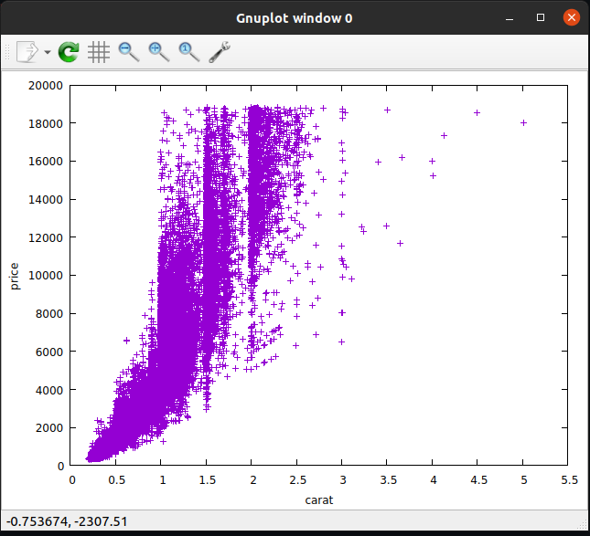

# gnuplot and feedgnuplot - 2023-03-31

## tldr;

`gnuplot` is a command line driven data visualization tool. It is highly
configurable and has it's own DSL for scripting. `feedgnuplot` is a wrapper
around `gnuplot` to make command line usage simpler by converting command line
options into scripts and piping them into `gnuplot`. Killer features include
support for a variety of backends including SVG and ASCII terminal, and realtime
streaming visualizations.

## Example

Scatterplot of diamonds price against carats:

```bash
< diamonds.csv  \
  qsv select carat,price \
  | sed 's/carat/# carat/' \
  | tr , ' ' \
  | feedgnuplot \
    --points \
    --terminal 'dumb 80,40' \
    --domain \
    --unset grid \
    --xlabel 'carat' \
    --ylabel 'price'
```

```
     20000 +----------------------------------------------------------------+
           |     +     +     +     +     +    +     +     +     +     +     |
           |              A AAAA  AAAAAAAAAAA  A    A                       |
     18000 |-+         AA  A AAAAAAAAAAAAAA    A                A     A   +-|
           |           AA AAAAAAAAAAAAAAAA A                                |
           |           AAA  AAAAAAAAAAAAAAAA  A             A               |
           |           AA A AAAAA  AAAAAAAA    A                            |
     16000 |-+         AAAAA AAAAAAAAAAAAAA    A   A  A   A               +-|
           |           AAAAAAAAAAAAAAAAAAA  A  A          A                 |
           |           AAAAAAAAAAAAAAAAAAA  A A                             |
     14000 |-+         AAAAAAAAAAAAAAAAA A A   A                          +-|
           |            AAAAAAAAAA AAAAA AA                                 |
           |           AAAAAAAAAAAAAAAAAAA  A A                             |
           |           AAAAAAAAAAAAAAAAA A       A  A                       |
     12000 |-+         AAAAAAAAAAAAAAAAAAA                                +-|
           |           AAAAAAAAAAAAAAAAA   A  A       A                     |
           |           AAAAAAAAAAAAAAAAA  A   AA                            |
     10000 |-+         AAAAAAAAAAA AAA  AAA A  A                          +-|
           |          AAAAAAAAAAAAAA    A  A   AA                           |
           |          AAAAAAAAAAA AA AA                                     |
           |          AAAAAAAAAAAA A AAA A A                                |
      8000 |-+       AAAAAAAAAAAAA AAA A A    AA                          +-|
           |         AAAAAAAAAAAA  AA A                                     |
           |      A A AAAAAAAAAAAAAAAAA    A                                |
      6000 |-+    A AAAAAAAAAAAA AAAAA  A     A                           +-|
           |       AAAAAAAAAAAAAAAAAAAA                                     |
           |      AAAAAAAAAAAAAA AAAA                                       |
           |     AAAAAAAAAAAAAA A                                           |
      4000 |-+   AAAAAAAAAAAAA                                            +-|
           |     AAAAAAAAAA  A                                              |
           |     AAAAAAAAAA  A                                              |
      2000 |-+ AAAAAAAAAAAA                                               +-|
           |  AAAAAAAAAA                                                    |
           |  AAAAAAAAAA                                                    |
           | AAAAAA    +     +     +     +    +     +     +     +     +     |
         0 +----------------------------------------------------------------+
           0    0.5    1    1.5    2    2.5   3    3.5    4    4.5    5    5.5
                                         carat
```

The same thing with the GUI backend:

```bash
< diamonds.csv  \
  qsv select carat,price \
  | sed 's/carat/# carat/' \
  | tr , ' ' \
  | feedgnuplot \
    --points \
    --domain \
    --unset grid \
    --xlabel 'carat' \
    --ylabel 'price'
```



## Links

- [gnuplot](http://www.gnuplot.info/)
- [feedgnuplot](https://github.com/dkogan/feedgnuplot)
- [vnlog](https://github.com/dkogan/vnlog)
- [scale2017 talk](https://www.youtube.com/watch?v=Qvb_uNkFGNQ&t=12830s)
- [qsv](https://github.com/jqnatividad/qsv)
- [tr](https://linux.die.net/man/1/tr)
