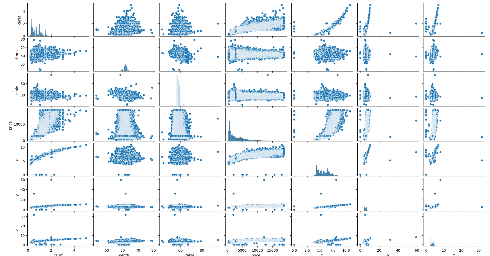
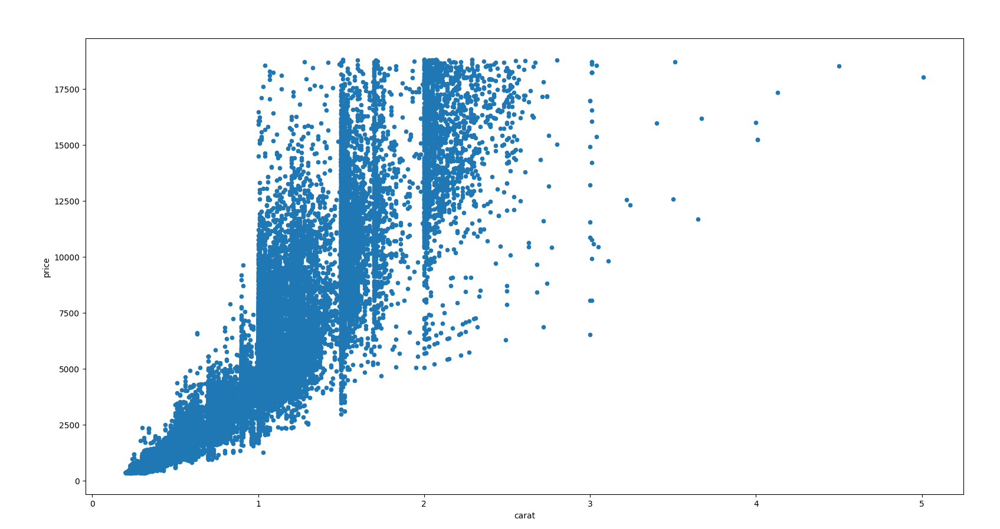
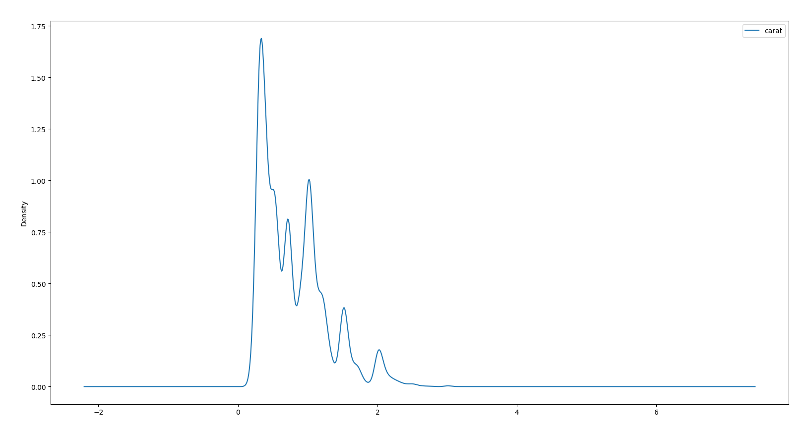
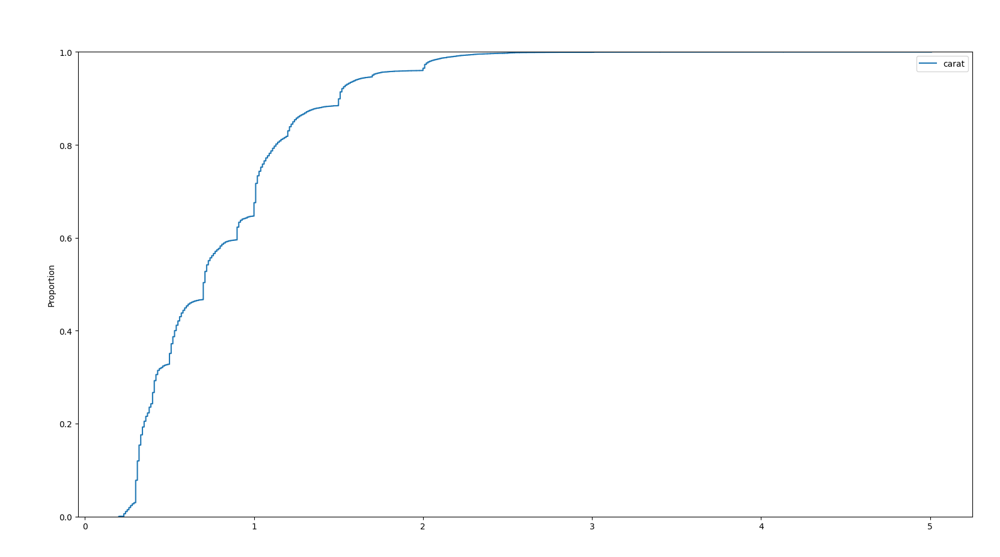

# Data visualization 2 - scatterplot, pairplot, kdeplot, ecdfplot - 2023-04-07

## tldr;

`scatterplot`, `pairplot`, `kdeplot` and `ecdfplot` are command line tools that
accept csv data from standard input and produce plots interactively in pop up
GUI windows. `scatterplot` and `pairplot` are useful for visually examining
correlations, while `kdeplot` and `ecdfplot` are useful for exploring the shape
of a distribution of data points.

## Example

`pairplot` is particularly useful for exploring correlations between pairs of
variables. This type of visualization is also called a "scatterplot matrix"
because it is a matrix of each possible combination of fields in the dataset. By
splitting a multidimensional dataset into many 2D datasets, it is easier to spot
the correlations.

```sh
< diamonds.csv ./pairplot
```



`scatterplot` takes a csv from stdin. It plots the first field as "x" and the
second field as "y".

```sh
< diamonds.csv qsv select 'carat,price' | ./scatterplot
```



`kdeplot` takes a single column csv. It is an alternative to histogram and can
be considered simpler to interpret.

```sh
< diamonds.csv qsv select 'carat' | ./kdeplot
```



The "ecdf" in `ecdfplot` stands for "Empirical Cumulative Distribution
Function". It is good for questions like: what percentage of the diamonds have
carat <= 1 or what is the maximum carat that covers 60% of the diamonds.

```sh
< diamonds.csv qsv select 'carat' | ./ecdfplot
```



## Links

- [qsv](https://github.com/jqnatividad/qsv)
- [seaborn](https://seaborn.pydata.org/)
- [matplotlib](https://matplotlib.org/)
- [pandas](https://pandas.pydata.org/)
