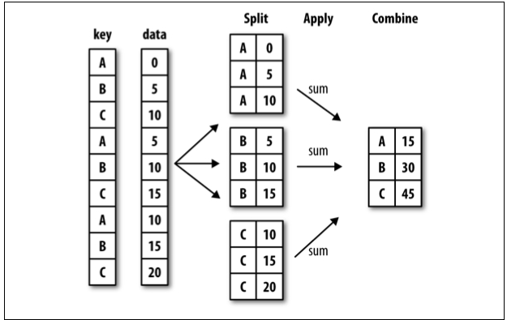

# qsv split apply combine

## tldr;

split-apply-combine is a data analysis pattern. It is a specific application of
the map-reduce pattern and achieves the same purpose as a sql aggregation with
groupby. The mechanics of a split-apply-combine pipeline are like this:



There are a few cases when split-apply-combine is particularly useful:

- **sql is not available** - e.g. when your data comes from files, REST apis,
  key-value stores, etc.
- **the apply stage is complex** - e.g. the apply stage can consist of filters
  and transformations in addition to an aggregation. The equivalent sql
  operation may require nested subqueries, case statements or if/else logic to
  accomplish the same thing, while the split-apply-combine pipeline can be
  decoupled more cleanly into steps.
- **observability is valuable** - when working in a command line data pipeline,
  intermediate files are saved for inspection. Compare this to a complex sql
  query where nested subqueries need to be extracted and run separately to
  inspect intermediate results.
- **the dataset is very large** - the `apply` stage of the pipeline, which is
  often the most computationally expensive, can be easily parallelized over
  multiple cores or even machines because the groups are decoupled

split-apply-combine can be accomplished from the command line using
`qsv partition` for the split, a combination of `qsv` commands in a bash script
with `parallel` for the apply, and `qsv cat` for the combine.

## Example

Split:

```bash
# Split by cut field
qsv partition 'cut' diamonds_by_cut diamonds.csv
```

Apply:

```bash
# mean price by cut
find diamonds_by_cut/ -name '*.csv' | parallel "./filestats {} diamonds_by_cut"
```

where `filestats` is this script:

```bash
#! /usr/bin/env bash

set -o errexit
set -o nounset

FILENAME="$1";
OUTDIR="$2";
KEY=$(basename -s .csv "$FILENAME");
TMP_KEYFILE="$OUTDIR/TMP_${KEY}field.csv"
TMP_STATSFILE="$OUTDIR/TMP_${KEY}stats.csv"
STATSFILE="$OUTDIR/${KEY}_stats.csv"
OUTFILE="$OUTDIR/${KEY}_mean.csv"

# prepare fixed field
cat > "$TMP_KEYFILE" << EOF
key
"$KEY"
EOF

# compute stats
qsv stats "$FILENAME" > "$TMP_STATSFILE"

# add new field, storing all the stats
qsv join --cross 1 "$TMP_KEYFILE" 1 "$TMP_STATSFILE" > "$STATSFILE"

# drop the tmp file
rm "$TMP_KEYFILE" "$TMP_STATSFILE"

# Filter to result
qsv search 'price' --select 'field' "$STATSFILE" \
  | qsv select 'key,mean' \
  > "$OUTFILE"
```

Combine:

```bash
# combine into single output
qsv cat rows diamonds_by_cut/*_mean.csv | qsv table

# Output:
key       mean
Fair      4358.7578
Good      3928.8645
Ideal     3457.542
Premium   4584.2577
VeryGood  3981.7599
```

This is a decent example pipeline, but the ergonomics could be improved by:

- a smoother way to add the key field to the stats table - probably a good `qsv`
  pull request
- removing the use of tmp files which add extra steps in the `filestats`
  script - the fix above should improve this

## Links

- [qsv](https://github.com/jqnatividad/qsv)
- [parallel](https://www.gnu.org/software/parallel/)
- [split-apply-combine diagram](https://www.oreilly.com/library/view/learning-pandas/9781783985128/ch09s02.html)
- [split-apply-combine paper](https://www.jstatsoft.org/article/download/v040i01/468)
