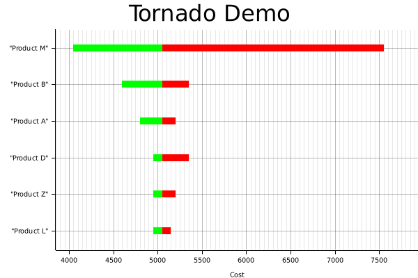

# Data visualization 3 - tornadoplot - 2023-04-14

## tldr;

`tornadoplot` is a command line tool that takes a json data file and outputs a
[tornado plot](https://en.wikipedia.org/wiki/Tornado_diagram) as a png. Tornado
plots are commonly used for sensitivity analysis.

## Example

The `tornadoplot` demo implementation visualizes a "one way sensitivity
analysis" whereby a high, low and expected value are supplied for each variable.
The plot visualizes the effect of replacing the value of one variable with the
high or low value, while holding the rest of the variables at the expected
value. The results are sorted, with the variable with the greatest variance is
at the top. This would represent the greatest risk factor in your model.

```sh
./tornadoplot data.json
```



## Links

- [plotters](https://github.com/plotters-rs/plotters)
- [serde](https://serde.rs/)
