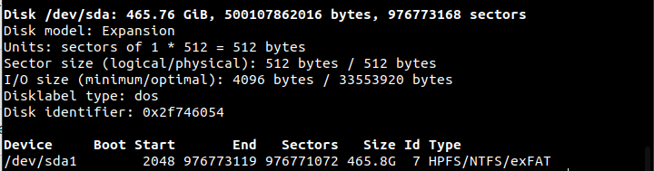
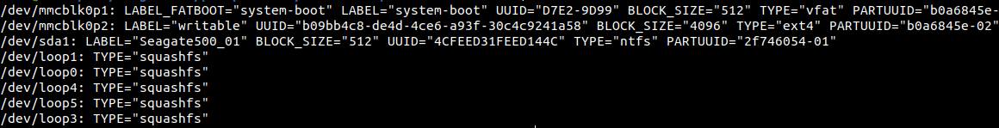
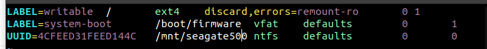
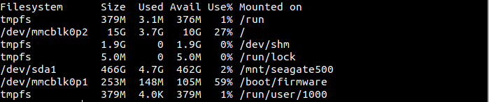

# Raspberry Pi Backup Machine Config

- Raspberry Pi 4b 4GB RAM, 16GB SD card
- Canakit power switch
- UGREEN powered USB hub
- Seagate USB SSDs
- Wifi configured at time of flash

- Ubuntu Server 22.04 OS
- rsync
- Automount SSD on startup (see below)

## Notes

It is critical to have a powered USB hub that does not backfeed power to the
Raspberry Pi. The UGREEN model seems to suffice, but I needed to find a USB-C
charger because the hub didn't ship with one.

## Automounting the SSD

- See if the pi recognizes the USB. You can do this with `sudo fdisk -l`

- Make a mount target directory `mkdir /mnt/seagate500`. I'm mounting at /mnt
  because it seems idiomatic, but it could really be anywhere.

- Get the device UUID using `sudo blkid`

- Edit `/etc/fstab` to automount the drive, using the UUID as it's identifier

- Reboot the pi and check that the drive shows up when `df -h` is called

