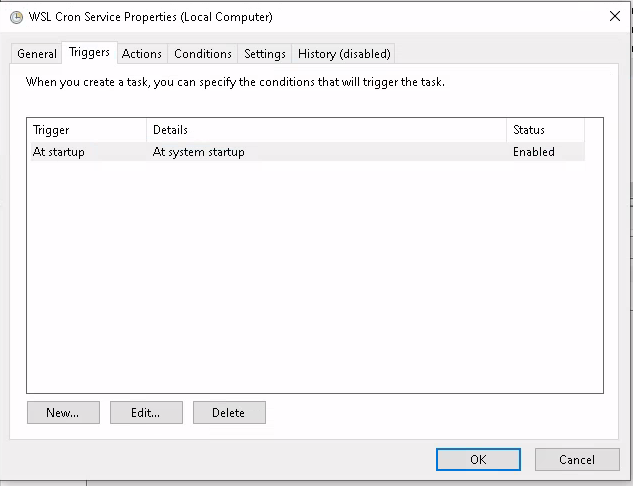

# Configure Windows to Backup Files Using Rsync

## Configure WSL Autostart cron

`rsync` is a linux tool, so you should run it through wsl. Running rsync
interactively on wsl is identical to running on native Ubuntu (assuming an
Ubuntu flavored wsl), but getting the cron to run is challenging because the
cron service on wsl is not started at startup. Therefore, you need to create a
Windows Task Manager job to start the cron service to allow linux to take over
and do the actual work.

- Use the Windows Task Scheduler GUI to create a startup task

## Prepare WSL

- Make an ssh key with `ssh-keygen` and get it onto the target device
- Allow starting the cron service without a password for all sudoers
  - `sudo visudo`
  - Add this line and save `%sudo ALL=NOPASSWD: /usr/sbin/service cron start`
- Add a script to perform your rsync somewhere e.g.
  `/home/zach/perform_rsync.sh`
- Use `crontab -e` to schedule the script to run
